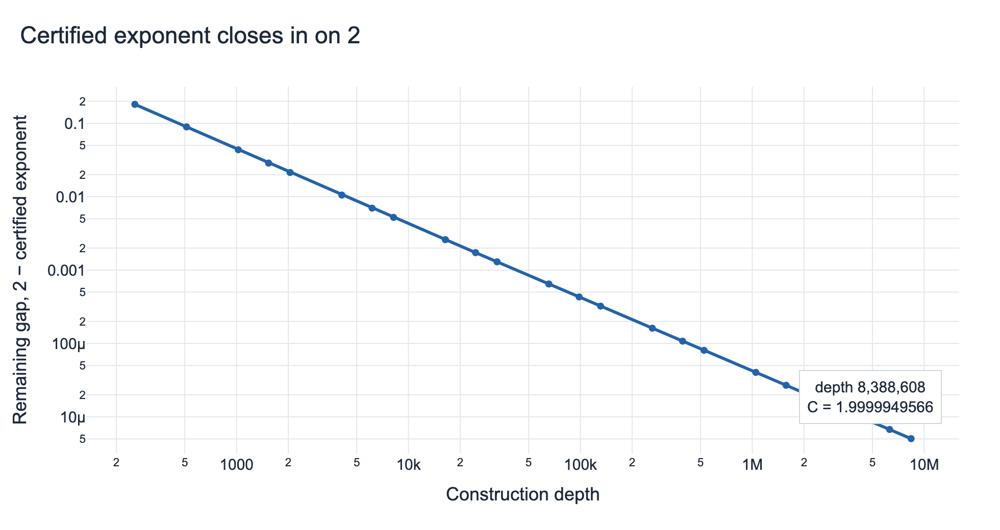
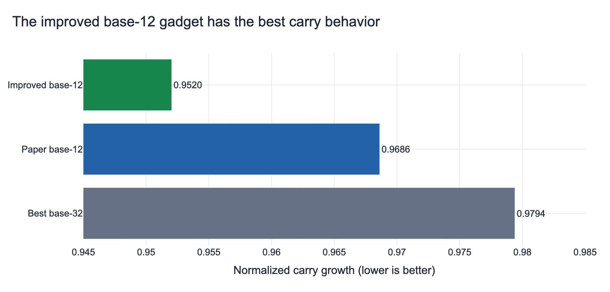
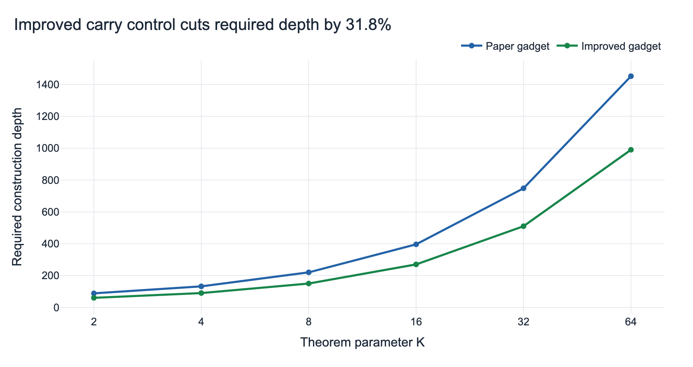
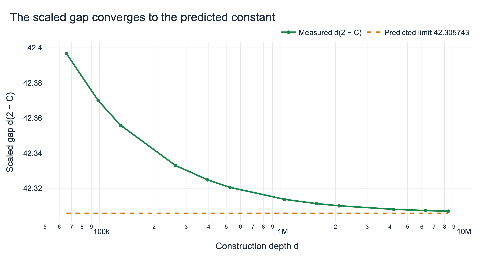
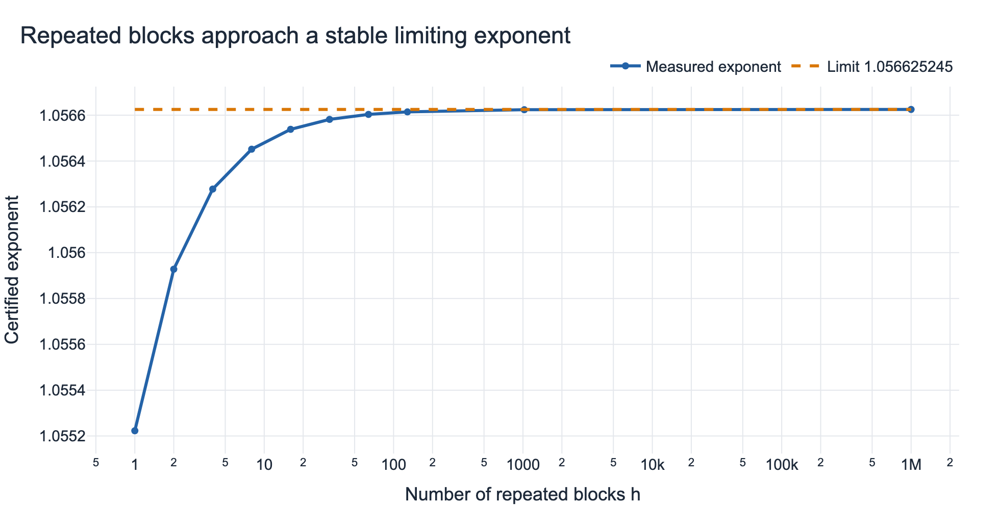

# Reproducing the optimal sumset–difference-set exponent

For a finite set of integers, adding every pair and subtracting every pair can produce collections of very different sizes. The paper asks how large that imbalance can be, and builds specially chosen numbers from repeated digit patterns so that addition grows much faster than subtraction. This reproduction checked the paper’s exact arithmetic and then tested whether improved digit patterns make the construction more efficient and push the resulting exponent closer to its limiting value.

## Verdict

**Reproduced, with a computational extension.** Fourteen successful Kubernetes runs reproduced all six targeted exact claim groups, verified the paper’s digit construction and toy example, found a stronger base-12 digit gadget, and certified an exponent of **1.999994956618507** at depth 8,388,608. The assessment uses only successful-run terminal measurements; one cancelled sizing run and four unsuccessful or deadline-limited runs are excluded from all claims.

**How to read the primary result.** The vertical axis is the remaining distance from the limiting exponent 2, so lower is better; both axes are logarithmic. The measured gap falls from about 0.182 at depth 256 to \(5.0434\times10^{-6}\) at depth 8,388,608. The final exact-integer computation gives \(C=1.999994956618507\); an independent floating-point evaluation differed by only about \(1.3\times10^{-14}\).

## What was tested

For a finite integer set \(A\), the sumset \(A+A\) contains all pairwise sums and the difference set \(A-A\) all pairwise differences. When the sumset is larger, the measured exponent is

\[
C=\frac{\log |A+A|}{\log |A-A|}.
\]

The construction encodes elements with a small allowed digit set. Its critical difficulty is carrying: carries couple neighboring digit positions and can destroy the naive product rule. The reproduction therefore checked direct enumerations, exact carry-state recurrences, modular convolution counts, rational spectral certificates, and large exact-integer exponent calculations.

The baseline passed all six targeted claim groups. In particular, the paper’s digit set \(\{0,1,2,4,5,9\}\) reproduced the stated three-state transition matrix and the recurrence values \(1,11,127,1475,17143\). A direct Chinese-remainder toy construction also matched \(|R|=432\), modular sum size 3,600, modular difference size 3,328, \(|A|=864\), \(|A+A|=13,859\), and \(|A-A|=13,125\).

## A better digit gadget

Carry growth is the bottleneck: values below 1 contract, and smaller is better. Searching bases 12 through 26 found \(\{0,1,3,4,5,8\}\), with normalized growth **0.9520357**, improving on the paper gadget’s **0.9686229**. Its exact recurrence is

\[
t_{j+3}=14t_{j+2}-31t_{j+1}+18t_j,
\]

and the logged rational certificate used \(v=(1,53/48,53/48)\), bounding the spectral radius by \(183/16\) and the normalized rate by \(61/64\). An exhaustive base-32 search checked all \(\binom{31}{15}=300{,}540{,}195\) normalized masks, fully evaluated 300,016,968 candidates, and carry-audited all 64 minimum-difference finalists. Its best rate, 0.9794007, was worse, which is useful negative evidence against simply increasing the base.

The improved contraction changes the sufficient depth from \(22(K+2)\) to \(15(K+2)\), a **31.8% reduction** across every tested theorem parameter. The logged examples range from 88 versus 60 positions at \(K=2\) to 1,452 versus 990 at \(K=64\). This is an efficiency improvement, not a change to the theorem’s limiting exponent.

## Why the near-2 result is credible

The raw exponent approaches 2, while the more discriminating diagnostic \(d(2-C)\) approaches a finite constant. It fell from 42.3967 at depth 65,536 to **42.3069503** at depth 8,388,608, against a predicted limit of **42.3057431**; the final residual was 0.0012073. This agreement probes the convergence law rather than merely showing a rounded exponent close to 2.

The deepest run also handled exact integers at scale: the relevant count had 9,052,829 decimal digits. Intermediate successful runs certified the smooth progression through depths 131,072, 524,288, 2,097,152, and 8,388,608, reducing the chance that the endpoint reflects a single numerical accident.

## Block-lift robustness

A separate repeated-block construction was monotone in all eight tested parameter grids. For the displayed representative case, the exponent increased from 1.0552229 at one block to 1.0566252440 at one million blocks, matching the computed limit 1.0566252454. Across the grid, the best limiting exponent was 1.0566252454, and the largest gain over two blocks was 0.01697145. This supports the predicted finite-to-infinite lifting behavior independently of the headline deep construction.

## Limitations and evidence boundary

All published numbers above came from terminal logs of 14 successful Kubernetes runs. The cluster job shape used two indexed replicas, but the retained measurement channel exposes the primary terminal log; the report therefore does not claim an independent cross-replica comparison. A cancelled sizing run had only preliminary output, and attempted base-42, base-38, and base-34 searches did not finish before their deadlines; none contributes evidence or a negative conclusion. The searches establish exact properties for the candidates they fully checked, while the large-depth series certifies the reported finite exponents and strongly validates the predicted asymptotic form; it is not a substitute for the paper’s general mathematical proof.

## Evidence summary

| Evidence group | Successful runs | Main logged measurement |
|---|---:|---|
| Baseline and carry audit | 2 | 6/6 claim groups; bases 12–26 audited |
| Improved gadget and block lifts | 3 | rate 0.9520357; 64 finite cases; 8 infinite-grid cases |
| General frontier and deep asymptotics | 8 | depth 256 through 8,388,608; final \(C=1.999994956618507\) |
| Exhaustive base-32 search | 1 | 300,540,195 masks; all 64 finalists carry-audited |
| Excluded non-evidence | 5 | 1 cancelled, 1 setup failure, 3 deadline failures |

The [self-contained notebook](notebook.py) includes the complete plotted measurements and regenerates every figure.
